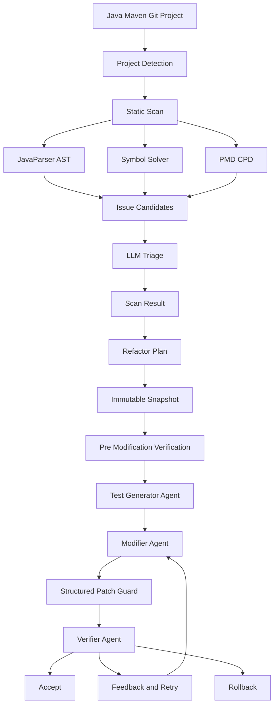

# Refactor Agent 面试学习资料

这份资料按面试准备顺序组织，不按源码目录组织。目标是让你能在面试中讲清楚：项目解决了什么问题、为什么这样设计、关键实现在哪里、指标怎么来的、遇到追问怎么回答。

## 1. 项目一句话

Refactor Agent 是一个面向 Java Maven Git 项目的安全重构 CLI。它先用 JavaParser AST、Symbol Solver 和 PMD CPD 做低成本静态扫描，生成代码坏味道候选，再让 LLM 做语义筛选和重构计划；真正修改时通过测试生成 Agent、修改 Agent、验证 Agent 组成闭环，用 Maven、JaCoCo、AST 校验、Diff 校验和快照回滚来降低 LLM 越界修改和误改风险。

面试开场可以这样说：

> 这个项目的核心不是“让 LLM 直接改代码”，而是把 LLM 放在一个受控工程流水线里。静态分析负责降低搜索空间，LLM 负责语义判断和局部编辑，多 Agent 和验证回滚负责把不可控输出变成可审计、可恢复的修改流程。

## 2. 主流程

你需要能手画下面这条链：

对应源码入口：

- `suncli_py/refactor_agent/interface/commands.py`：CLI 主流程，`run_scan`、`run_plan`、`run_apply`。
- `suncli_py/refactor_agent/analysis/scanner.py`：七类坏味道候选扫描。
- `suncli_py/refactor_agent/assistant/orchestrator.py`：`apply` 的测试生成、修改、验证、重试和回滚编排。
- `suncli_py/refactor_agent/execution/patcher.py`：结构化行级编辑、路径边界和补丁应用。
- `suncli_py/refactor_agent/execution/verifier.py`：Maven 编译测试、JaCoCo、Diff 和工作区检查。

## 3. 六个简历亮点怎么讲

### 亮点 1：静态分析先生成候选，再让 LLM 语义筛选

问题背景：

纯 LLM 全仓搜索有两个问题：一是上下文太大，Token 成本高；二是 LLM 容易漏扫或重复扫。项目把“搜索”交给确定性工具，把“判断这个候选是否真的值得改”交给 LLM。

实现方式：

- `JavaSmellScanner.scan()` 先收集 Java 文件，调用 AST helper 做结构化分析。
- 规则扫描覆盖长方法、大类、复杂条件、命名不清、死代码、特性依恋、重复代码。
- JavaParser 提供方法行号、类成员数量、分支数、嵌套深度。
- Symbol Solver 提供方法调用、字段访问和归属类型，用于特性依恋等语义更强的规则。
- PMD CPD 用于重复代码检测。
- `run_scan()` 在候选生成后调用 LLM assistant 做 triage，输出 accept / reject / uncertain。

面试表达：

> 我没有让 LLM 直接全仓搜索，而是把它放在第二阶段。第一阶段用 AST 和 CPD 生成召回率较高的候选，第二阶段让 LLM 结合局部源码判断是否是真问题。这样 LLM 处理的是几十个结构化候选，而不是整个仓库，所以耗时和 Token 都明显下降。

指标准备：

- 你简历里的 56.5% 耗时下降、67.5% Token 下降，要能说清实验口径。
- 建议口径：同一批 Maven 项目、同一批坏味道任务，对比“LLM 直接检索全仓”与“静态候选 + LLM triage”的平均 wall-clock time 和 API usage。
- 如果被问样本规模，要如实说明。如果样本较小，就说“在我构造和收集的评测集上”。

### 亮点 2：多 Agent 降低自我验证偏差

问题背景：

单 Agent 同时写代码和验证自己的代码，容易确认偏差：它会倾向于认为自己的改动正确，也容易忽略 diff 中的越界修改。

实现方式：

- `RefactorAgentOrchestrator` 中拆分了 `TestGeneratorAgent`、`ModifierAgent`、`VerifierAgent`。
- 三个 Agent 有不同角色、提示词、任务输入和对话历史。
- 修改前先由 `PreModificationVerifier` 跑原始项目的 compile、test、JaCoCo。
- 覆盖不足时先生成行为锁定测试，并在原始代码上预检通过后才允许业务代码修改。
- 验证失败时把验证 Agent 的反馈传回修改 Agent，最多重试 N 次。

面试表达：

> 这里的核心设计是职责隔离。测试 Agent 的目标是锁住当前行为，修改 Agent 的目标是按计划做最小编辑，验证 Agent 的目标是挑错和拒绝。这样避免了一个 Agent 既当运动员又当裁判。

关键代码：

- `suncli_py/refactor_agent/assistant/orchestrator.py`：创建三个 Agent，并在每轮失败时记录 feedback。
- `suncli_py/refactor_agent/execution/verifier.py`：修改前和修改后验证。

指标准备：

- Pass@1 75.0% 到 88.3% 的提升，要说明成功定义。
- 推荐定义：一个任务在不人工介入情况下，最终通过编译、测试、覆盖和验证 Agent 审查，且目标坏味道消除。
- 如果被问为什么不是 100%，回答失败通常来自覆盖不足、LLM 无法生成正确局部编辑、目标项目本身测试不稳定或 AST 校验拒绝。

### 亮点 3：结构化行级编辑防止 LLM 越界修改

问题背景：

LLM 直接输出整文件或自由 diff 时，容易改到无关文件、引入格式噪音、改公开 API 或删除不该删的代码。

实现方式：

- 修改 Agent 只能输出结构化 edit plan：`file_path`、`start_line`、`end_line`、`replacement`。
- `RefactorPatcher._changes_from_llm_edits()` 校验文件必须在 plan 白名单内。
- 行号必须合法，路径不能绝对路径，不能越出项目根目录，不能落在 `.git`、`target`、`build` 等目录。
- 写入后 `AstPatchValidator` 用 JavaParser 重新解析修改前后文件。
- AST 校验会拒绝类声明异常变化和非 private 方法签名变化。
- 应用失败时恢复写入前内容。

面试表达：

> 我把 LLM 的输出从“自由写代码”约束成“结构化行级编辑”。真正落盘的是本地 patcher，不是 LLM。patcher 负责校验路径、白名单、行号、AST 和公开 API，校验失败就恢复文件。

可能追问：

- 为什么不直接用 git apply？  
  因为我需要在 apply 前做业务语义约束，比如只能改 plan 中的文件、行号范围必须合法、不能改公开签名；这些不是普通 patch 工具能完整表达的。

### 亮点 4：验证与回滚闭环

问题背景：

重构不是只看“代码能不能编译”，还要看是否达成目标、是否改了计划外文件、是否破坏测试和覆盖。

实现方式：

- 修改前创建不可变快照。
- 修改后运行 Maven compile、JaCoCo test、JaCoCo report。
- 从快照生成真实 workspace diff，不信任 Agent 自己声称的 diff。
- 检查 plan 之外的文件是否变化。
- 验证失败则保留证据，反馈给修改 Agent 进入下一轮。
- 多轮仍失败，执行 rollback 恢复全部文件；如果是中间修复轮，会保留已验证的行为锁定测试。

面试表达：

> 我把验证分成两层：机器验证和 Agent 验证。机器验证负责 compile/test/coverage/diff/hash，Agent 验证负责结合重构计划判断目标坏味道是否真正消除。最终以真实工作区状态为准，而不是相信修改 Agent 的输出。

关键代码：

- `VerificationPipeline.verify()`：执行 Maven 和覆盖率检查。
- `_actual_workspace_diff()`：根据快照重建真实 diff。
- `_workspace_findings()`：检查工作区范围。
- `TaskRollbacker`：从任务快照恢复文件。

### 亮点 5：三层记忆解决跨会话知识复用

问题背景：

多轮 Chat 和多次任务之间，项目约定、用户偏好、历史结论容易丢失；但把全部历史塞进上下文又会超预算。

实现方式：

- PAI.md 项目记忆：稳定项目约定、命令、架构和注意事项。
- 长期记忆：用户显式保存的事实，分项目级和全局级。
- 会话短期记忆：当前对话和工具结果。
- 早期历史过长时压缩，保留用户目标、关键结论和待办。
- prompt 注入时按任务检索相关记忆，而不是全量注入。

面试表达：

> 我把记忆分成稳定项目知识、长期事实和当前会话三层。这样既能跨会话复用，又不会把所有历史无差别塞进上下文。对 LLM 来说，这比单纯拼接聊天记录更可控。

关键代码：

- `suncli_py/memory/manager.py`：记忆门面，负责 prompt_context、短期记忆和压缩触发。
- `suncli_py/memory/project.py`：读取 PAI.md，支持导入和字符预算。
- `suncli_py/memory/storage.py`：长期和短期记忆存储。

### 亮点 6：只读工具并行，写操作串行

问题背景：

ReAct Agent 常常需要读取多个文件、搜索调用方、看测试风格。这些只读工具没有依赖关系，串行执行会浪费时间；但写操作并行会造成竞态和不可预测状态。

实现方式：

- `_execute_tool_calls()` 判断如果一次有多个 tool call，且全部是 read-only，就用 `asyncio.gather` 并行。
- 每个工具调用通过 `asyncio.to_thread()` 扔到线程里执行。
- 只要包含写工具，就退回串行执行。

面试表达：

> 我只并行化无副作用的工具调用，写操作仍然串行。这样能降低读取阶段耗时，同时不引入并发写文件导致的状态不一致。

指标准备：

- 57.6% 工具阶段耗时降低，要准备对比口径：同一组 ReAct 轨迹中工具调用阶段的耗时，串行执行与只读并行执行对比。

## 4. 代码定位清单

| 简历能力 | 关键文件 | 面试时要说的点 |
| --- | --- | --- |
| CLI 主流程 | `suncli_py/refactor_agent/interface/commands.py` | `scan`、`plan`、`apply` 的入口和错误处理 |
| 项目检测 | `suncli_py/refactor_agent/analysis/project_detector.py` | 检查 Git、Maven、Java、Maven、PMD plugin |
| AST 分析 | `suncli_py/refactor_agent/analysis/java_ast.py` | Python 调 Maven helper，解析 JSON AST 结果 |
| Java helper | `suncli_py/refactor_agent/analysis/java_ast_helper/` | JavaParser 和 Symbol Solver |
| 坏味道候选 | `suncli_py/refactor_agent/analysis/scanner.py` | 七类规则和候选排序编号 |
| LLM triage / plan | `suncli_py/refactor_agent/assistant/llm_assistant.py`、`assistant/planner.py` | LLM 判断候选和生成计划 |
| ReAct runtime | `suncli_py/refactor_agent/assistant/react.py` | 迭代、工具调用、停滞检测、并行工具 |
| 多 Agent 编排 | `suncli_py/refactor_agent/assistant/orchestrator.py` | 测试生成、修改、验证、反馈和回滚 |
| 补丁应用 | `suncli_py/refactor_agent/execution/patcher.py` | 结构化编辑、白名单、行号、快照和恢复 |
| AST patch 校验 | `suncli_py/refactor_agent/execution/patch_validator.py` | 类结构和非 private API 稳定 |
| 覆盖率 | `suncli_py/refactor_agent/analysis/coverage.py` | 解析 JaCoCo XML，目标区域 80% 阈值 |
| 验证 | `suncli_py/refactor_agent/execution/verifier.py` | Maven、JaCoCo、真实 diff、工作区检查 |
| 回滚 | `suncli_py/refactor_agent/execution/rollback.py` | 从任务快照恢复 |
| 记忆 | `suncli_py/memory/manager.py`、`suncli_py/memory/project.py` | PAI.md、长期记忆、短期记忆、压缩 |

## 5. 高频追问与回答

### Q1：为什么不用 LLM 直接扫描全仓？

答：

LLM 全仓扫描成本高、结果不稳定，也不适合做完整召回。静态分析更擅长低成本、可重复地提取结构信号，比如方法长度、嵌套深度、调用归属、重复代码。LLM 更擅长结合上下文判断“这个候选是否真的有重构价值”。所以我做成两阶段：静态工具召回，LLM 精排。

### Q2：七种坏味道分别怎么识别？

答：

- 长方法：方法行数、分支数、嵌套深度。
- 大类：类行数、字段数、方法数、public 方法数。
- 复杂条件：条件表达式、布尔操作和控制嵌套。
- 命名不清：局部变量、方法名、类后缀等规则。
- 死代码：private 方法或字段未被引用。
- 特性依恋：方法访问外部类型成员多于自身类型成员。
- 重复代码：PMD CPD 输出重复片段。

补一句：规则只生成候选，不直接等于最终问题，最终还要 LLM triage。

### Q3：Symbol Solver 在这里解决什么问题？

答：

单纯文本或 AST 只能看到“调用了某个名字”，但不知道这个方法或字段属于哪个类型。Symbol Solver 能解析调用归属和字段类型，所以可以判断一个方法是不是大量访问外部类，从而支撑特性依恋检测，也能减少同名方法导致的误判。

### Q4：多 Agent 比单 Agent 好在哪里？

答：

单 Agent 容易自我验证偏差，而且上下文里会混合测试、修改、验证目标。多 Agent 把目标拆开：测试 Agent 只负责锁行为，修改 Agent 只负责按计划改代码，验证 Agent 只负责挑错和拒绝。每个 Agent 的提示词和历史隔离，失败反馈通过结构化消息传递。

### Q5：怎么保证生成的测试不是空测试或恒真断言？

答：

测试生成 Agent 被限制只能在确定的 `src/test/java` 候选路径新建测试，要求包含有效 `@Test` 和可观察断言。生成后先在原始代码上做 test-compile、两次完整 test，并通过 JaCoCo 确认覆盖目标文件。只有这些预检通过，才允许进入修改 Agent。

### Q6：怎么防止 LLM 改不该改的文件？

答：

第一，计划里有 `files_to_modify` 白名单。第二，LLM 输出不是自由 diff，而是结构化行级编辑。第三，patcher 校验路径必须在项目根内、不能是绝对路径、不能进入 `.git` / `target` / `build` 等目录。第四，应用后会基于快照检查真实工作区 diff，发现计划外修改就拒绝。

### Q7：为什么还要 AST patch 校验，测试通过不够吗？

答：

测试通过只能说明已有测试覆盖的行为没失败，不代表公开 API 没被破坏，也不代表结构没有异常变化。AST 校验可以在测试之外检查 Java 语法可解析、类声明稳定、非 private 方法签名没有被意外改动，是测试的补充防线。

### Q8：验证 Agent 和 Maven 测试是什么关系？

答：

Maven 测试是确定性机器检查，验证 Agent 是语义审查。机器检查回答“能不能编译、测试、覆盖够不够、diff 有没有越界”；验证 Agent 回答“这个 diff 是否符合重构计划、目标坏味道是否真的消除、有没有引入新的坏味道”。两者都通过才接受。

### Q9：如果原项目测试本身就是失败的怎么办？

答：

修改前会先跑原始项目基线。如果原始代码 compile 或 test 不通过，就禁止自动修改，因为这时无法区分失败是原本存在还是重构引入的。系统会返回 baseline_failed，而不是继续冒险修改。

### Q10：回滚怎么做？

答：

`apply` 一开始就对计划内文件创建不可变快照，并记录 workspace manifest。失败时从快照恢复。修复重试前会恢复业务代码，但可以保留已经通过预检的自动生成测试；最终失败或基础设施错误时恢复业务代码并删除自动生成测试。

### Q11：这些指标怎么测的？

答：

面试中不要只报数字，要说明口径：

- 耗时和 Token：同一批扫描任务，对比纯 LLM 全仓搜索和“静态候选 + LLM triage”。
- 成功率：同一批重构任务，对比单 Agent Pass@1 和多 Agent 验证反馈闭环。
- 工具耗时：同一批 ReAct 轨迹，对比只读工具串行执行和并行执行。

如果被问是否有统计显著性，可以诚实说明样本规模，并强调它是项目内评测指标，不夸大成工业级 benchmark。

### Q12：项目的不足是什么？

答：

可以主动说三点：

- 支持语言范围有限，主要针对 Java Maven 项目。
- 坏味道规则是启发式的，召回和误报都依赖阈值，需要更多项目校准。
- LLM 网关和模型能力会影响计划和修改质量，所以必须有本地验证和回滚兜底。

这类回答比“没有不足”更可信。

## 6. 2 分钟讲稿

> 我做的是一个 Java Maven 项目的安全重构 Agent。问题背景是，直接让 LLM 搜索和修改整个仓库成本高、不可控，容易误报坏味道，也容易越界修改。  
>
> 所以我把流程拆成几层。第一层是静态分析：用 JavaParser AST、Symbol Solver 和 PMD CPD 扫描代码，生成七类坏味道候选，比如长方法、大类、复杂条件、死代码、特性依恋和重复代码。第二层是 LLM 语义筛选，让 LLM 只判断这些结构化候选是否真的值得重构，而不是全仓盲搜。这样在我的评测里平均耗时降低 56.5%，Token 降低 67.5%。  
>
> 真正修改时，我没有用一个 Agent 从头做到尾，而是拆成测试生成、修改、验证三个 Agent。修改前先跑 Maven 编译测试和 JaCoCo 覆盖，如果目标区域覆盖不足，就先生成行为锁定测试，并在原始代码上预检通过后才允许修改。修改 Agent 只能输出结构化行级编辑，patcher 会校验文件白名单、路径边界、行号范围，写入后再用 JavaParser 检查语法结构和公开 API 变化。  
>
> 最后验证 Agent 会结合真实 diff、重构计划、Maven 测试、JaCoCo 和工作区哈希判断是否接受。失败就把证据反馈给修改 Agent 重试，多轮仍失败就从快照回滚。这个设计的核心是把 LLM 的不确定性关进一个可验证、可审计、可恢复的工程闭环里。

## 7. 5 分钟深挖讲稿结构

按这个顺序讲，面试官容易跟上：

1. 背景：LLM 直接重构的问题是成本高、不稳定、容易越界。
2. 扫描层：AST / Symbol Solver / CPD 生成候选，LLM 做语义筛选。
3. 计划层：把候选转成结构化 RefactorPlan，明确目标文件、风险、验证命令、覆盖评估。
4. 修改层：多 Agent 分工，测试先行，修改只输出结构化行级编辑。
5. 安全层：白名单、路径、行号、AST 结构、公开 API、真实 diff、workspace manifest。
6. 验证层：Maven compile/test、JaCoCo、验证 Agent 审查、失败反馈和回滚。
7. 记忆与性能：PAI.md / 长期记忆 / 会话压缩；只读工具并行降低工具阶段耗时。
8. 结果与不足：报指标，同时说明样本口径和局限。

## 8. 面试前复习清单

必须能背：

- 主流程：`scan -> plan -> apply -> preflight -> test generation -> modify -> verify -> retry/rollback`。
- 七种坏味道和每种检测信号。
- 为什么静态分析 + LLM 比纯 LLM 更好。
- 为什么多 Agent 能降低自我验证偏差。
- 结构化行级编辑如何防越界。
- JaCoCo 在修改前和修改后的作用。
- 回滚的触发条件和恢复范围。

必须能定位：

- `commands.py` 讲 CLI 主流程。
- `scanner.py` 讲坏味道规则。
- `orchestrator.py` 讲多 Agent 闭环。
- `patcher.py` / `patch_validator.py` 讲补丁安全。
- `verifier.py` / `coverage.py` 讲验证和覆盖率。
- `react.py` 讲 ReAct、停滞检测和只读工具并行。
- `memory/manager.py` / `memory/project.py` 讲三层记忆。

必须准备的数据说明：

- 56.5% 耗时下降：对比对象、任务数、平均耗时。
- 67.5% Token 降低：统计 input/output 还是总 Token。
- 75.0% 到 88.3%：成功定义、失败如何计入。
- 57.6% 工具阶段耗时降低：工具阶段的计时范围。

## 9. 简历表述微调建议

当前简历已经比较强，但面试前建议把数字对应的口径准备好。如果简历空间允许，可以把“多 Agent 修改验证回滚闭环”改得更工程化：

> 设计静态分析候选召回 + LLM 语义筛选 + 多 Agent 安全修改验证闭环；通过 AST、覆盖率、真实 Diff、工作区快照和回滚机制约束 LLM 修改边界。

对于第 2 点，“修改前,测试 agent”建议写成：

> 修改前由测试 Agent 基于 JaCoCo 检查目标区域覆盖，覆盖不足时生成行为锁定测试，并在原始代码上完成 test-compile、双轮 test 与覆盖预检。

对于第 4 点，“工作区哈希检查”建议在面试中解释成：

> 用初始快照和 workspace manifest 校验真实工作区变化，避免只相信 LLM 声称的 diff。

